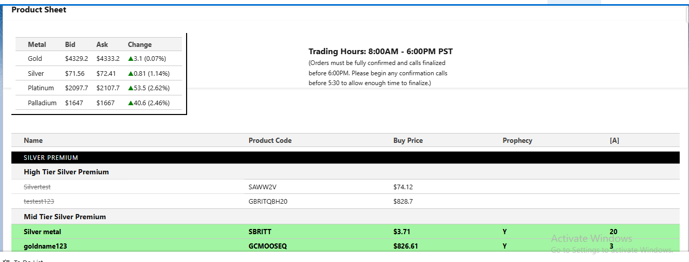

---
# Real-Time Precious Metals Trading Product Sheet (Salesforce LWC)

This repository demonstrates a real-world **precious metals trading platform** built on Salesforce using Lightning Web Components (LWC) and Apex.

The system provides:
- Live **spot prices** (Gold, Silver, Platinum, Palladium)
- Tradable **product sheets** with premiums and availability
- Real-time UI updates for trading desks and brokers

This architecture is used by bullion dealers, trading desks, and financial institutions.

---

## Business Problem

Precious metals trading requires:
- Real-time market prices
- Dynamic product premiums
- Inventory availability
- Fast and reliable UI updates

Traders must be able to see:
- Live Bid / Ask prices
- Which products are tradable
- Which products are cut (sold out)
- Which products are active for trading

All of this must update continuously during market hours.

---

## System Architecture

- Live Gold, Silver, Platinum & Palladium spot prices
- Tiered product sheets (Premium, Bullion, High Tier, Mid Tier)
- Real-time bid / ask price updates
- Visual indicators for tradable vs sold-out products
- Automatic refresh during trading hours
- External trading system integration
- Built with Salesforce LWC + Apex
